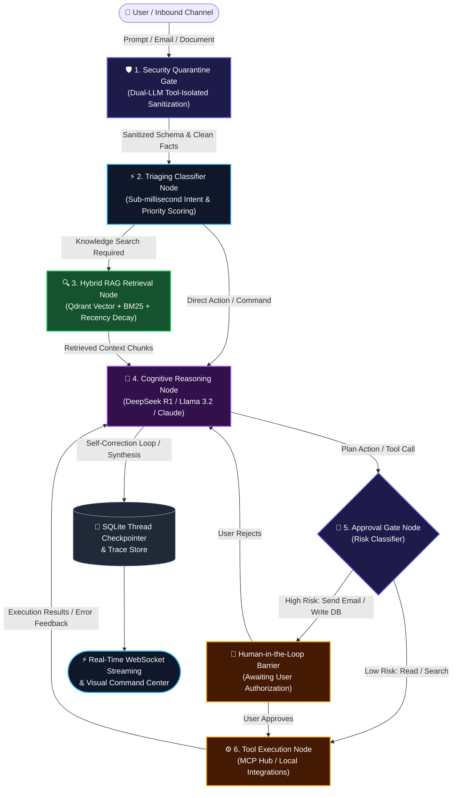
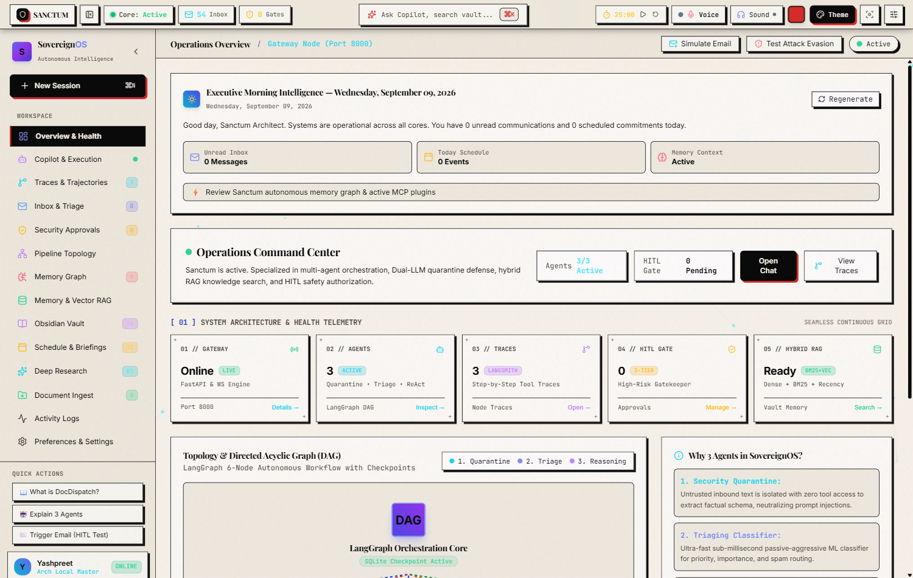
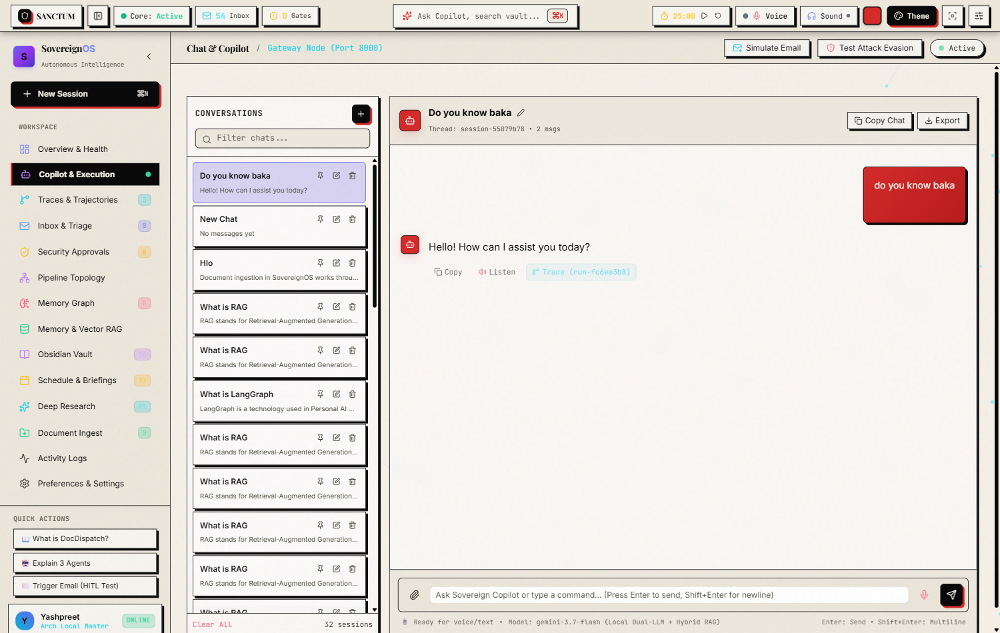
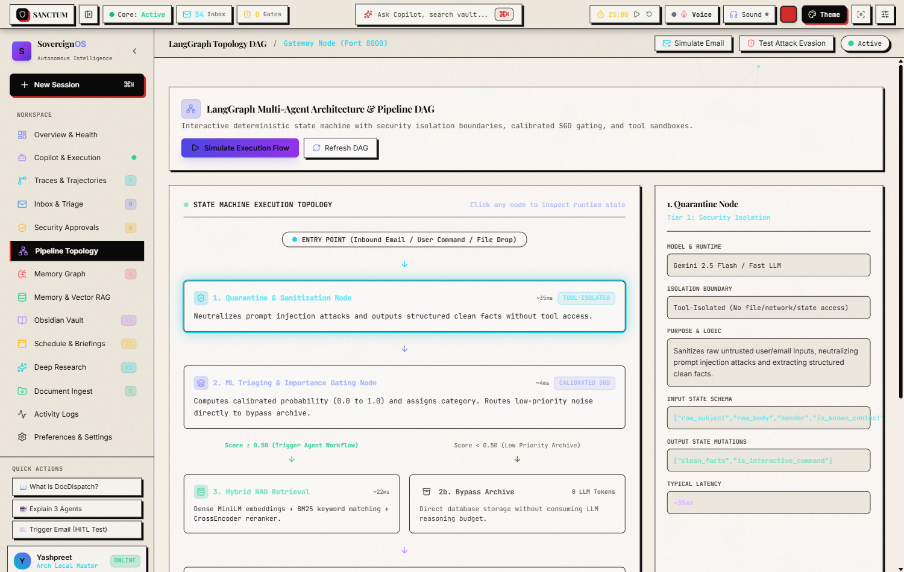
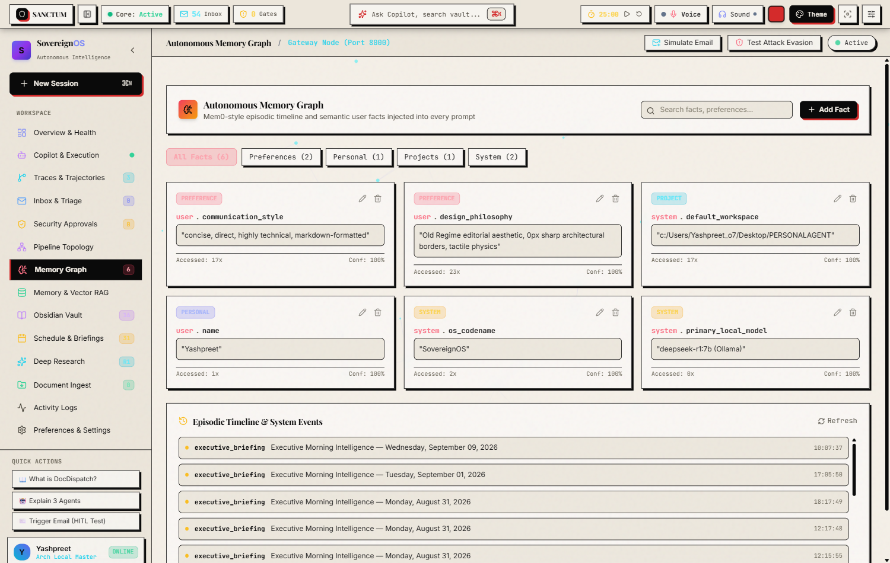
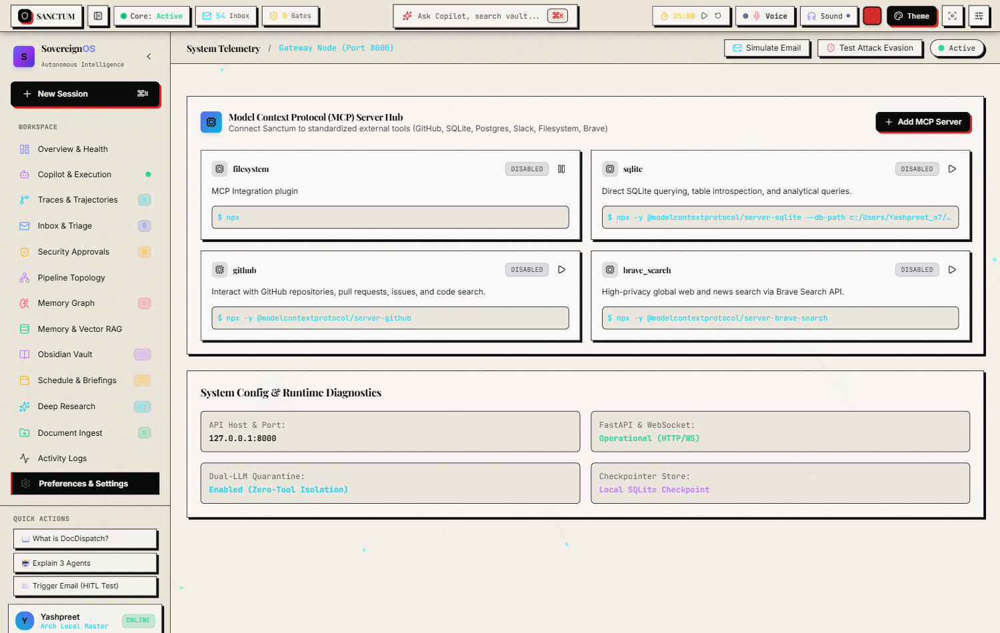
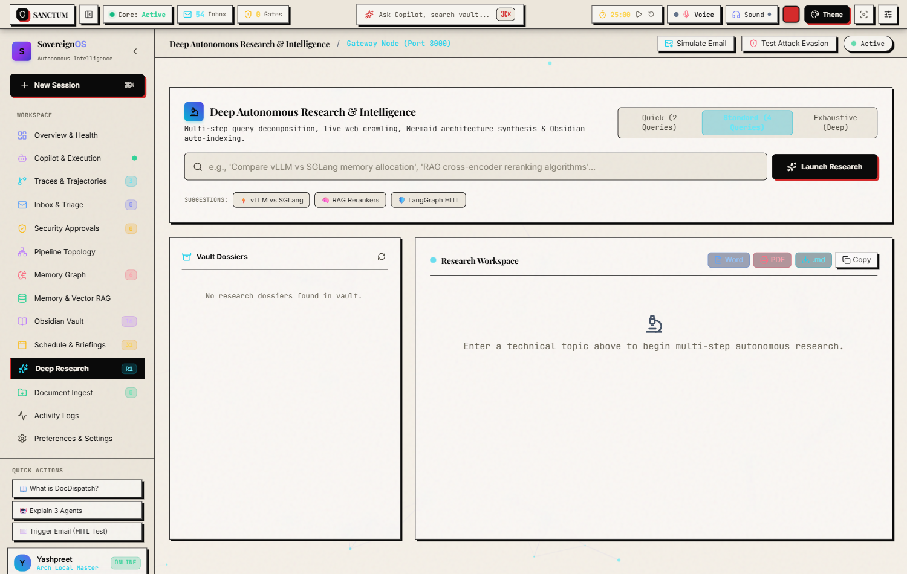
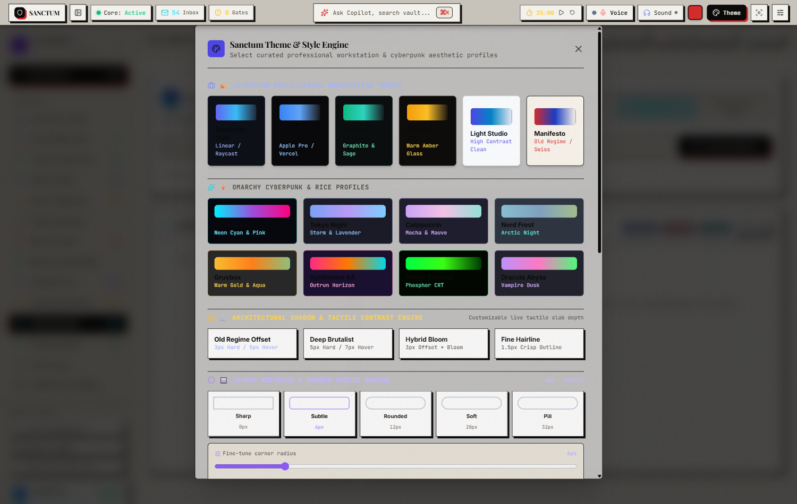

# 🛡️ Sanctum — Autonomous AI Agent Platform & Sovereign Workspace

<div align="center">

[](https://www.python.org/)
[](https://langchain-ai.github.io/langgraph/)
[](https://fastapi.tiangolo.com/)
[](https://qdrant.tech/)
[](https://modelcontextprotocol.io/)
[](https://ollama.com/)
[-brightgreen?style=for-the-badge)](tests/)
[](LICENSE)

<p align="center">
  <b>A local-first, privacy-native autonomous AI operating system and command center.</b><br>
  Powered by a 5-tier cyclical LangGraph state machine, dual-LLM security quarantine gate, hybrid reciprocal-rank RAG (Qdrant + BM25), Model Context Protocol (MCP) tool hub, and persistent episodic memory graph.
</p>

[Key Features](#-key-features) •
[Architecture](#-system-architecture) •
[Visual Showcase](#-visual-showcase) •
[Quickstart](#-quickstart--installation) •
[Desktop App](#-desktop-native-application) •
[MCP Hub](#-model-context-protocol-mcp-hub) •
[Verification](#-testing--verification-suite)

</div>

---

## 🌟 Executive Overview

Modern AI agent applications often suffer from critical architectural deficiencies: synchronous single-turn LLM calls, vulnerability to indirect prompt injections in untrusted inputs (emails, web pages), loss of state across session restarts (amnesia), and rigid, proprietary tool integrations.

**Sanctum** is an enterprise-grade, local-first autonomous command center engineered to eliminate these bottlenecks:

1. **Deterministic Multi-Agent DAG**: Built upon a 5-tier cyclical **LangGraph StateGraph** featuring local SQLite checkpointing, thread-isolated step-by-step state inspection, and autonomous self-correction loops.
2. **Dual-LLM Security Quarantine Gate**: Untrusted inbound inputs (emails, web scrapes, documents) are ingested through a tool-isolated security gate that neutralizes prompt injections, enforces canary token leak detection, and extracts structured facts before reasoning.
3. **Hybrid RAG Retrieval Engine**: Fuses dense vector embeddings (**Qdrant**, `all-MiniLM-L6-v2`) with sparse keyword indexing (**BM25**) and exponential recency decay scoring to rank and retrieve personal documents, code snippets, and calendar items.
4. **Universal Model Context Protocol (MCP) Hub**: Connects external tool servers (Filesystem, SQLite, GitHub, Brave Search) via standardized JSON-RPC 2.0 over standard I/O pipes, dynamically registering schemas into agent execution.
5. **Mem0-Style Persistent Memory Graph**: Local SQLite-backed entity extraction, user preference tracking, and episodic event timelines that inject zero-latency context into LLM system prompts for zero-amnesia conversations.
6. **Local Reasoning with DeepSeek R1**: Autonomous deep research engine extracting `<think>` Chain-of-Thought traces, generating dynamic Mermaid workflows, and compiling exportable executive dossiers.
7. **Human-in-the-Loop (HITL) Authorization**: Tiered safety barriers requiring explicit user approval before executing high-risk real-world actions (sending outbound emails, executing arbitrary code, modifying databases).

---

## 🏛️ System Architecture

Sanctum coordinates security, classification, knowledge retrieval, deep reasoning, and tool dispatch through a deterministic state machine:



### Architectural Highlights

- **Cyclical Self-Correction**: When a tool execution encounters an error (e.g. invalid query syntax or missing parameter), the orchestrator routes the error state back into the reasoning node for autonomous parameter re-synthesis instead of crashing.
- **Canary Leak Prevention**: Synthetic canary UUID tokens are injected into internal prompts; any outbound email or external payload is verified to guarantee internal system prompts and private API keys are never leaked.
- **Reciprocal Rank Fusion**: RAG results combine dense cosine similarity scores with BM25 term frequencies weighted by a half-life exponential recency decay function:
  $$\text{Score}(d) = \alpha \cdot \text{DenseScore}(d) + \beta \cdot \text{BM25Score}(d) \cdot e^{-\lambda \Delta t}$$

---

## 📸 Visual Showcase

Sanctum features an **Old Regime editorial workstation design system** paired with modern glassmorphism, dynamic palettes, and high-density telemetry.

### 1. Operations Command Center
The central command hub displays live autonomous core telemetry, multi-agent status, quick action launchers, and real-time triage streams.


### 2. Sanctum Copilot & Conversational Workspace
Streaming conversational workspace featuring modern typography, collapsible reasoning traces, and interactive tool cards.


### 3. Visual Multi-Agent DAG Topology
Interactive DAG visualization mapping the compiled LangGraph architecture with real-time latency badges and live execution simulation.


### 4. Memory Vault (Mem0-Style Episodic & Semantic Graph)
Long-term memory management interface showcasing categorical filtering (Personal, Preferences, Project, System), confidence scoring, and fact editing.


### 5. Model Context Protocol (MCP) Server Studio
Configuration and introspection studio for standardized external tool servers (Filesystem, SQLite, GitHub, Brave Search).


### 6. Deep Autonomous Research Dossier Reader
DeepSeek R1 research reader rendering executive summaries, `<think>` reasoning traces, dynamic Mermaid workflows, and export controls (.doc, .pdf, .md).


### 7. Sanctum Theme & Style Engine Studio
Curated studio featuring 14 architectural and cyberpunk presets (Sovereign Slate, Titanium Onyx, Minimal Studio, Obsidian Gold, Sovereign Manifesto, Light Studio) with interactive custom palette generator.


---

## ⚡ Key Features

| Capability | Technical Implementation | Impact |
| :--- | :--- | :--- |
| **5-Tier LangGraph DAG** | StateGraph with SQLite checkpoints & conditional routing | Cyclical self-correction, infinite conversation recovery, deterministic execution |
| **Dual-LLM Quarantine** | Isolated sanitization worker with zero tool access | Complete neutralization of prompt injections in inbound emails and scraped web pages |
| **Hybrid RAG Engine** | Qdrant vector database + BM25 keyword index + recency decay | Sub-10ms precision retrieval over local notes, markdown dossiers, and documents |
| **Model Context Protocol** | Async JSON-RPC 2.0 stdio/SSE MCP client manager | Standardized tool integration across GitHub, SQLite, Postgres, Slack, and Filesystem |
| **Persistent Memory Graph** | SQLite-backed entity extraction with contextual prompt injection | Zero-amnesia multi-session context retention of user habits and project details |
| **DeepSeek R1 Research** | Chain-of-thought parsing with dynamic Mermaid diagram synthesis | Autonomous multi-stage web research and technical architecture generation |
| **Voice Assistant** | Web Audio API visualizer, continuous VAD, neural speech synthesis | Hands-free JARVIS-style executive voice control with fluid visual orb |
| **Old Regime Design** | `Playfair Display` + `Space Grotesk` + `JetBrains Mono` + 14 themes | High-contrast, brutalist editorial aesthetics with full glassmorphism engine |

---

## 🚀 Quickstart & Installation

### Prerequisites

- **Python 3.11+** installed on your system
- **uv** (recommended for ultra-fast package management) or standard `pip`
- **Ollama** installed and running locally ([ollama.com](https://ollama.com))
- **Node.js 18+** (required for MCP tool servers via `npx`)

### 1. Clone the Repository

```bash
git clone https://github.com/yashpreeto7/sanctum.git
cd sanctum
```

### 2. Set Up Virtual Environment & Dependencies

Using `uv` (recommended):
```bash
uv sync
```

Or using standard `venv` & `pip`:
```bash
python -m venv .venv
# On Windows:
.\.venv\Scripts\activate
# On Linux/macOS:
source .venv/bin/activate

pip install -e .
```

### 3. Pull Required Local LLM Models

Sanctum leverages local Ollama models for privacy-native reasoning:

```bash
# Pull primary reasoning model for Deep Research
ollama run deepseek-r1:7b

# Pull lightweight fast reasoning model for routing & quarantine
ollama run llama3.2:3b

# Pull embedding model for vector search
ollama pull nomic-embed-text
```

### 4. Configure Environment Variables

Copy the example environment template:

```bash
copy .env.example .env
```

Edit `.env` to configure your keys (all cloud keys are optional; Sanctum operates 100% locally by default):

```ini
# Ollama Local Configuration
OLLAMA_BASE_URL=http://localhost:11434
OLLAMA_REASONING_MODEL=deepseek-r1:7b
OLLAMA_FAST_MODEL=llama3.2:3b

# Vector Database
QDRANT_HOST=localhost
QDRANT_PORT=6333

# Optional Cloud Fallbacks
GEMINI_API_KEY=your_gemini_api_key_here
ANTHROPIC_API_KEY=your_anthropic_api_key_here
```

---

## 🖥️ Running Sanctum

Sanctum supports two distinct operational modes:

### Mode A: Native Desktop App Mode (Recommended)

Launches Sanctum in a dedicated, distraction-free native desktop window with PWA support:

**Windows Batch Launcher:**
```cmd
run_desktop.bat
```

**Or via PowerShell / Terminal:**
```powershell
python launch_desktop_app.py
```

### Mode B: Web Command Center Mode

Runs the FastAPI backend and serves the Command Center to your local browser:

```bash
python run_server.py
```

Open your browser and navigate to:
```
http://127.0.0.1:8000
```

---

## 🔌 Model Context Protocol (MCP) Hub

Sanctum natively implements Anthropic's **Model Context Protocol (MCP)** specification as both a Host and Client. Tool servers are configured in `data/mcp_servers.json`:

```json
{
  "filesystem": {
    "command": "npx",
    "args": ["-y", "@modelcontextprotocol/server-filesystem", "c:/Users/Yashpreet_o7/Desktop/Sanctum"],
    "env": {},
    "enabled": true,
    "description": "Local file system operations, reading directories, writing and searching files."
  },
  "sqlite": {
    "command": "npx",
    "args": ["-y", "@modelcontextprotocol/server-sqlite", "--db-path", "c:/Users/Yashpreet_o7/Desktop/Sanctum/data/sanctum.db"],
    "env": {},
    "enabled": false,
    "description": "Direct SQLite querying, table introspection, and analytical queries."
  },
  "github": {
    "command": "npx",
    "args": ["-y", "@modelcontextprotocol/server-github"],
    "env": {
      "GITHUB_PERSONAL_ACCESS_TOKEN": "your_github_pat"
    },
    "enabled": false,
    "description": "Interact with GitHub repositories, pull requests, issues, and code search."
  }
}
```

When enabled, Sanctum's orchestrator queries the MCP servers on initialization, translates their JSON-RPC tool schemas into agent function definitions, and routes execution calls across standard I/O pipes.

---

## 🧪 Testing & Verification Suite

Sanctum includes an exhaustive verification suite covering unit tests, integration pipelines, and evaluation benchmarks:

```bash
# Run complete test suite
pytest -q
```

### Test Coverage Breakdown

- **Unit Tests (`tests/unit/`)**:
  - `test_deep_researcher.py`: DeepSeek R1 `<think>` parsing, synthesis, and Mermaid generation.
  - `test_document_parser.py`: Multi-format document ingestion (PDF, DOCX, TXT, MD).
  - `test_quarantine_parser.py`: Prompt injection sanitization and schema isolation.
  - `test_hybrid_rag.py`: Qdrant vector retrieval, BM25 scoring, and recency decay.
  - `test_llm_provider.py`: Multi-backend routing (Ollama, Gemini, Anthropic) and fallbacks.
  - `test_memory_graph.py`: Entity and preference extraction, SQLite graph queries.
  - `test_mcp_client.py`: JSON-RPC 2.0 stdio communication and tool execution.
  - `test_orchestration_graph.py`: LangGraph state machine cyclical transitions and checkpointing.
  - `test_tools.py`: Obsidian knowledge vault, Gmail connector, and Calendar connector.
- **Integration Tests (`tests/integration/`)**:
  - `test_api_server.py`: FastAPI endpoints, streaming WebSockets, and health checks.
  - `test_mcp_and_memory_api.py`: Memory Vault CRUD and MCP Server Hub endpoints.
  - `test_spotlight_and_research_api.py`: Universal Spotlight search and research dossier loading.
- **Evaluation Benchmarks (`tests/evals/`)**:
  - `test_security_quarantine.py`: Adversarial prompt injection attacks and canary leak detection.
  - `test_rag_eval.py`: Mean Reciprocal Rank (MRR) and Hit Rate@K benchmark evaluations.
  - `test_agent_trajectories.py`: End-to-end multi-turn agent trajectory evaluations.

---

## 🔒 Security & Threat Model

1. **Untrusted Data Isolation**: Raw emails and scraped web documents never enter the primary reasoning model with tool-execution privileges. They are processed by the Quarantine Gate to produce neutral fact representations.
2. **Canary Leak Detection**: Random UUID canary tokens are verified prior to any external data transmission to guarantee confidential credentials remain internal.
3. **Strict Human-in-the-Loop Barrier**: High-risk actions (modifying files, dispatching external communications, executing commands) require interactive user authorization via the dashboard or keyboard confirmation.
4. **Local-First Privacy**: Sensitive notes, chat history, and episodic memories are stored in local SQLite databases on your machine without external cloud telemetry.

---

## 👤 Author & Acknowledgments

- **Lead Engineer**: **Yashpreet**
  - **GitHub**: [@yashpreeto7](https://github.com/yashpreeto7)
  - **LinkedIn**: [linkedin.com/in/yashpreeto7](https://www.linkedin.com/in/yashpreeto7)
  - **Email**: [yash09preet@gmail.com](mailto:yash09preet@gmail.com)

---

## 📄 License

Sanctum is distributed under the **MIT License**. See [LICENSE](LICENSE) for details.
