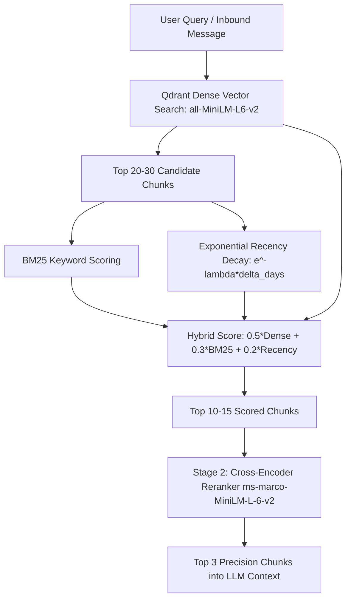

# Directive: Knowledge Retrieval, Hybrid RAG & Temporal Decay

## Goal
Retrieve personal context (emails, Obsidian notes, calendar events, project documents) using a two-stage hybrid retrieval pipeline that balances semantic meaning, exact keyword matching, and recency decay.

## Pipeline Architecture

## Tools & Modules
- **Vector Store**: `execution/rag/vector_store.py`
  - `insert_chunks(chunks)`: Ingests documents into local Qdrant collection with Sentence-Transformers embeddings.
  - `search_dense(query, limit)`: Fast vector cosine similarity search.
- **Hybrid Retriever**: `execution/rag/hybrid_retriever.py`
  - `search(query, top_k=20)`: Multi-factor scoring ($0.5 \cdot \text{Dense} + 0.3 \cdot \text{BM25} + 0.2 \cdot \text{Recency}$).
- **Cross-Encoder Reranker**: `execution/rag/reranker.py`
  - `rerank(query, candidates, top_n=3)`: Prunes candidates down to top 3 highest-scoring snippets using exact token-interaction cross-encoding.

## Temporal Decay Parameters
- **Half-life**: 14 days by default.
- A 2-day-old email receives a recency multiplier of $\approx 0.90$.
- A 60-day-old email receives a recency multiplier of $\approx 0.05$ unless strongly matched by semantic meaning and exact keywords.
