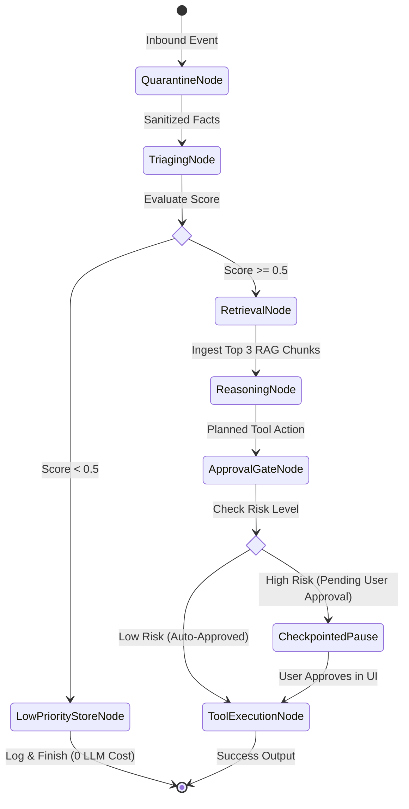

# Directive: Stateful LangGraph Orchestration & HITL Safety Protocol

## Goal
Manage stateful multi-step agent workflows with resilient state checkpointing, deterministic tool execution, and zero unauthorized high-risk operations.

## LangGraph State Machine Architecture

## Tool Risk Taxonomy
| Tool Name | Risk Level | Execution Policy |
| :--- | :--- | :--- |
| `obsidian.create_note` | **LOW** | Auto-execute |
| `obsidian.append_daily_log` | **LOW** | Auto-execute |
| `obsidian.search_notes` | **LOW** | Auto-execute |
| `rag.search` | **LOW** | Auto-execute |
| `calendar.list_events` | **LOW** | Auto-execute |
| `calendar.create_event` | **MEDIUM** | Auto-execute / Notify in UI |
| `email.create_draft` | **MEDIUM** | Auto-execute / Notify in UI |
| `email.send` | **HIGH** | **Explicit Approval Required** |
| `shell.execute` | **HIGH** | **Explicit Approval Required** |

## Resuming Checkpointed Workflows
When an agent hits a high-risk tool (`email.send`), LangGraph snapshots the execution state to the checkpointer and returns `PENDING`.
When the user approves via API/UI (`POST /api/approvals/{id}/resolve`):
1. `permission_manager.resolve_request(id, approved=True)`
2. The engine resumes the saved thread checkpoint directly at `tool_execution_node` without re-running prior LLM steps.
